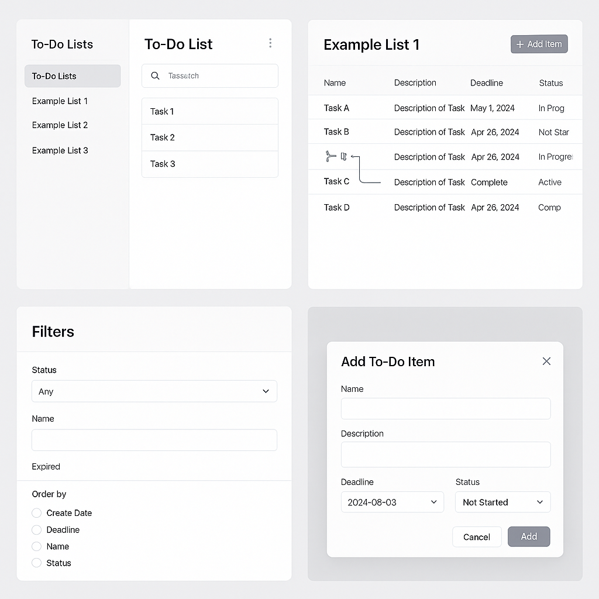

# Yapılacaklar Listesi Uygulaması

# To-Do List Frontend (React yada NextJs)

React kullanarak tek sayfa halinde bir yapılacaklar listesi uygulaması geliştirmeniz bekleniyor. Veriler React içinde statik olarak saklanacaktır. Not: (Eğer full-stack taskı ise backend ile etkileşimlik olacak)

## Beklenen Özellikler

- **Yapılacaklar listesi oluşturma**  
  Her bir liste bir adı olacaktır.

- **Yapılacaklar listelerinin görüntülenmesi**  
  Var olan tüm listeler listelenir.

- **Yapılacaklar listesini silme**

- **Mevcut bir listeye yapılacak madde ekleme**

- **Yapılacak maddeler arası bağımlılık ekleme**  
  Bir madde, bağımlı olduğu madde tamamlanmadan “tamamlandı” olarak işaretlenemez.

- **Her bir madde için:**  
  - Ad  
  - Açıklama  
  - Bitiş tarihi  
  - Durum

- **Maddeyi “Tamamlandı” olarak işaretleme**

- **Filtreleme**  
  - Duruma göre (tamamlandı / tamamlanmadı)  
  - Süresi dolmuş mu  
  - Ada göre

- **Sıralama**  
  - Oluşturulma tarihine göre  
  - Bitiş tarihine göre  
  - Ada göre  
  - Duruma göre

- **Yapılacak maddesini listeden silme**

## Genel Beklentiler
- Projenin bütün detayları sorulacak o yüzden bütün detayları öğrenerek geliştirmeleri yapın.
- Projenizin hiçbir ek bağımlılık olmadan kolayca çalıştırılabilir olması.
- React TypeScript Ya da Next.js kütüphaneleri olarak Tailwind kullanabilirsiniz.
- Ön yüzde tercih ettiğiniz paket yöneticisini kullanın.
- En az 3 birim testi (unit test) yazın.
- Fake Server kullanarak uygulamayı entegre et (https://github.com/typicode/json-server)
- ChatGPT tarafından üretilmiş kodları kullanmayın; denetlenecektir.
- Kurulum ve çalıştırma adımlarını açıklayan bir dökümantasyon ekleyin.  
  **[OPSİYONEL]** Vercel'e yükleyin
- Projenizi paketlenmiş dosya ya da GitHub üzerinden paylaşın.

# To-Do List Uygulaması Mockup Görselleri

## Ekran Açıklamaları

1. **Ana Ekran (Dashboard)**  
   - Sol panelde tüm yapılacaklar listeleri  
   - Sağ panelde seçili listenin genel görünümü  

2. **Liste Detayı**  
   - Her bir görevin adı, açıklaması, bitiş tarihi ve durumu  
   - Görevler arası bağımlılık okları  

3. **Filtre ve Sıralama**  
   - Duruma (Tamamlandı/Tamamlanmadı), ada veya süresi dolmuş olup olmamasına göre filtre  
   - Oluşturulma tarihi, bitiş tarihi, ada veya duruma göre sıralama  

4. **Yeni Görev Ekleme Modalı**  
   - Görev adı, açıklama, bitiş tarihi ve durum seçeneği  
   - “Ekle” ve “İptal” butonları

# To-Do List Backend (FastAPI + SQLite)

## Görev Tanımı

**To-Do List** uygulamasının sunucu tarafı (backend) kodunu **FastAPI** ve **SQLite** kullanarak geliştirmeniz bekleniyor. Uygulama, frontend’den gönderilecek RESTful API isteklerini karşılayacak; listeler ve bu listelere ait görevler üzerinde CRUD (Create, Read, Update, Delete) işlemlerini ve görevler arası bağımlılık kontrolünü sağlayacaktır.

---

## Teknik Gereksinimler

- Python 3.9+
- FastAPI
- SQLite (dosya tabanlı veritabanı)
- SQLAlchemy veya SQLModel
- Alembic (isteğe bağlı, migration için)
- pytest ile en az **3 birim testi**
- Docker-compose haline getir yada vercel'e yükle

---

## Özellikler ve API Endpoints

### 1. To-Do Listeleri Yönetimi

| Method | Path             | Açıklama                              | Request Body               | Response Body                  |
|--------|------------------|---------------------------------------|----------------------------|--------------------------------|
| GET    | `/lists`         | Tüm listeleri getirir                 | —                          | `[ { "id": 1, "name": "Alışveriş" }, … ]` |
| POST   | `/lists`         | Yeni liste oluşturur                  | `{ "name": "Proje" }`      | `{ "id": 2, "name": "Proje" }`  |
| DELETE | `/lists/{list_id}` | Belirli bir listeyi siler           | —                          | `{ "detail": "Silindi" }`      |

### 2. Görev (To-Do Item) Yönetimi

| Method | Path                                         | Açıklama                                                | Request Body                                                           | Response Body                                                                                   |
|--------|----------------------------------------------|---------------------------------------------------------|------------------------------------------------------------------------|-------------------------------------------------------------------------------------------------|
| GET    | `/lists/{list_id}/items`                     | Bir listedeki tüm görevleri getirir                     | Query Params: `status`, `name`, `expired` (bool), `order_by`          | `[ { "id": 1, "name": "...", "status": "PENDING", … }, … ]`                                      |
| POST   | `/lists/{list_id}/items`                     | Yeni görev ekler                                        | `{ "name": "...", "description": "...", "deadline": "2025-06-01", "status": "PENDING" }` | `{ "id": 5, "name": "...", … }`                                                               |
| PATCH  | `/items/{item_id}/complete`                  | Görevi tamamlandı olarak işaretler (bağımlılık kontrolü) | —                                                                      | `{ "id": 5, "status": "COMPLETED" }`                                                            |
| DELETE | `/items/{item_id}`                           | Belirli bir görevi siler                                | —                                                                      | `{ "detail": "Silindi" }`                                                                      |

### 3. Bağımlılık Yönetimi

| Method | Path                                      | Açıklama                                        | Request Body                       | Response Body                                                         |
|--------|-------------------------------------------|-------------------------------------------------|------------------------------------|-----------------------------------------------------------------------|
| POST   | `/items/{item_id}/dependencies`           | Bir görevin başka bir göreve bağımlı olmasını ekler | `{ "depends_on_id": 3 }`           | `{ "item_id": 5, "depends_on": 3 }`                                   |
| GET    | `/items/{item_id}/dependencies`           | Görevin tüm bağımlılıklarını listeler           | —                                  | `[ { "depends_on_id": 3 }, … ]`                                       |

---
